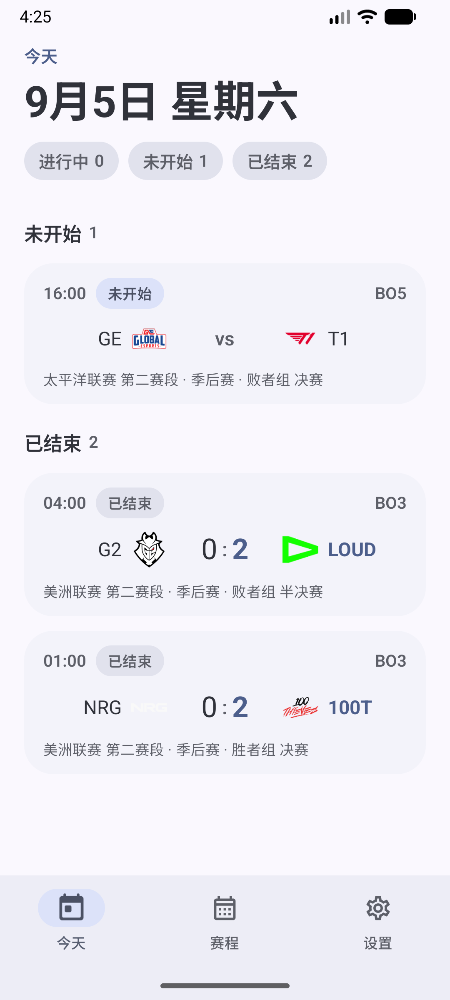
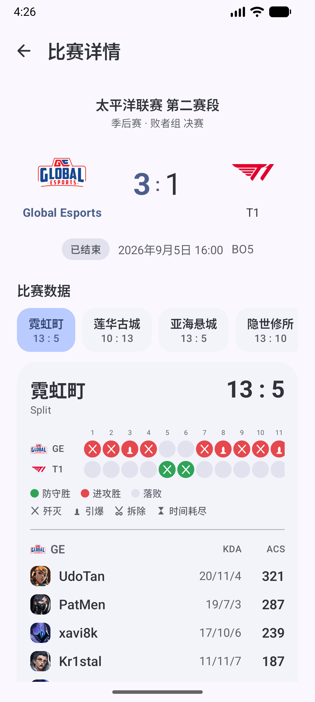

# 无畏契约赛程（VALORANT Schedule）

基于号角（haojiao.cc）无畏契约分区 API 的 Android 原生应用：浏览赛程与比赛详情，附桌面小组件。
Kotlin + Jetpack Compose + Material 3 Expressive（material3 1.5.0-alpha）。

> 仅本地展示，无登录、无上传、无服务端；数据版权归号角所有，仅供学习交流使用，请控制请求频率。

## 截图

<p>
  
  
</p>

## 功能

- **今天**：当日赛程按状态分组（进行中 / 未开始 / 已结束），汇总胶囊可筛选，下拉刷新。
- **赛程**：默认「过去 7 天 + 未来 14 天」按日分组、自动定位今天；支持按周平移、日期范围查询、状态筛选。
- **详情**：赛事信息与大比分；已开赛展示每图小局比分、攻防半场、逐回合时间轴与选手数据；点队标看近期战绩。
- **设置**：主题模式、动态取色、赛事级别过滤（S/A/B/C）、小组件背景不透明度。
- **小组件**：展示近期 4 场未结束比赛（全部结束时回退最近完赛），点击直达详情，每小时后台刷新一次。

## 构建

JDK 17+ 与 Android SDK（compileSdk 37），或 Android Studio 直接打开。

```bash
./gradlew :app:assembleDebug
# 产物：app/build/outputs/apk/debug/app-debug.apk
```

## API

数据来自 `https://api.haojiao.cc`，实现见 `data/HaojiaoApi.kt`：

| 接口                                          | 用途                                 |
| --------------------------------------------- | ------------------------------------ |
| `POST /wiki/api/v1/match/list_visitor`        | 比赛列表，按时间窗过滤               |
| `GET /wiki/api/v1/match/battle_detail`        | 比赛总览                             |
| `GET /wiki/api/v1/match/get_valorant_round`   | 逐回合明细与选手数据（未开赛返回空） |
| `GET /wiki/api/v1/foresight/recent_big_match` | 双方近期大赛战绩                     |

- 请求头签名：`x-hj-sign = SHA1(SALT + nonce + timestamp)`。
- `text/plain` 响应为 AES-192-CBC 加密的 Base64，OkHttp 拦截器统一解密。
- 比赛状态：`1 未开始 · 2 进行中 · 3 已结束`；未开赛时对阵双方可能为 null（待定）。
- 图片相对路径拼接在 `https://files.haojiao.cc` 下。

## 请求频率

- 列表 / 详情均有内存缓存（TTL 5 / 15 分钟）+ 按 key 单飞，下拉刷新才强制联网。
- 小组件：WorkManager 每小时刷新一次并落磁盘快照；系统触发的重绘只读快照。
- 图片走 Coil 磁盘缓存；无轮询、无常驻后台。

## 目录

```
app/src/main/java/com/rzh/valo/
├── MainActivity.kt        # 单 Activity：底部导航 + 详情路由 + 小组件深链
├── ValoApplication.kt     # AppContainer 手动依赖注入
├── data/                  # API 客户端、模型、缓存仓库、快照与设置存储
├── ui/                    # home / schedule / detail / settings + 共享组件与主题
└── widget/                # Glance 小组件与每小时刷新任务
```
