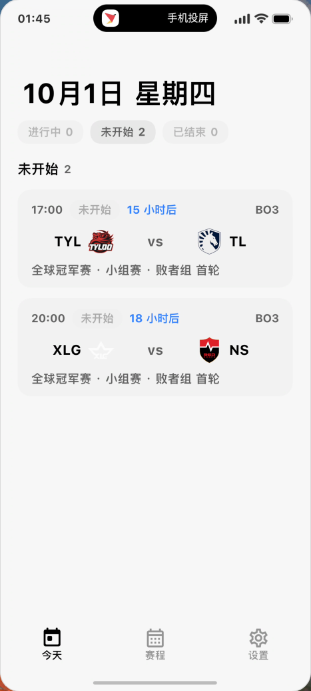
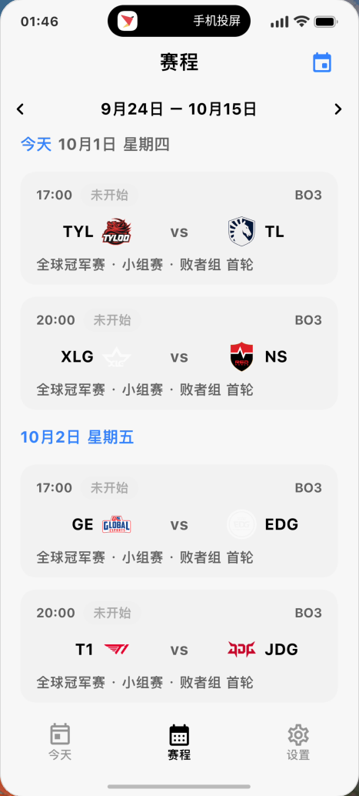
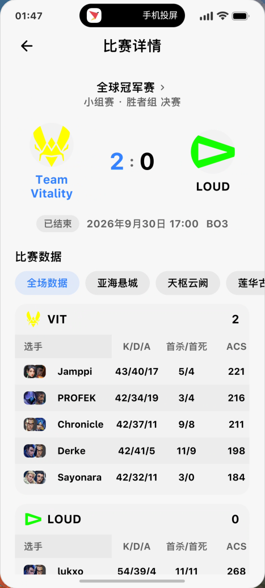

# 无畏契约赛程（VALORANT Schedule）

基于号角（haojiao.cc）无畏契约分区 API 的赛程应用：浏览赛程与比赛详情，附桌面小组件。
Kotlin Multiplatform（Android + iOS）+ Compose Multiplatform + [miuix](https://github.com/compose-miuix-ui/miuix)（HyperOS 风格组件库）。

> 仅本地展示，无登录、无上传、无服务端；数据版权归号角所有，仅供学习交流使用，请控制请求频率。

## 平台

| 平台    | 模块                   | 入口                                   |
| ------- | ---------------------- | -------------------------------------- |
| Android | `androidApp`           | `MainActivity`（含 Glance 桌面小组件） |
| iOS     | `iosApp`（Xcode 工程） | `shared` 导出的 `MainViewController`   |
| 共享    | `shared`               | 数据层 + 全部 UI（commonMain）         |

## 功能

- **今天**：当日赛程按状态分组（进行中 / 未开始 / 已结束），汇总胶囊可筛选，下拉刷新。
- **赛程**：默认「过去 7 天 + 未来 14 天」按日分组、自动定位今天；支持按周平移、日期范围查询、状态筛选。
- **详情**：赛事信息与大比分；已开赛展示每图小局比分、攻防半场、逐回合时间轴与选手数据；点队标进战队主页。
- **战队**：基础信息、战队/选手数据、地图胜率、赛事名次、完整赛程（按对手搜索 + 时间范围筛选）。
- **赛事**：阶段筛选、分组积分榜、赛事赛程。
- **设置**：主题模式（跟随系统 / 浅色 / 深色）、赛事级别过滤（S/A/B/C）、关于与检查更新。
- **小组件**（Android）：展示近期 4 场未结束比赛（全部结束时回退最近完赛），点击直达详情，每小时后台刷新一次。

## 截图

|                     今天                      |                       赛程                        |                       比赛详情                       |
| :-------------------------------------------: | :-----------------------------------------------: | :--------------------------------------------------: |
|  |  |  |

## 构建

JDK 21 与 Android SDK（compileSdk 37），或 Android Studio 直接打开。

```bash
# Android
./gradlew :androidApp:assembleDebug
# 产物：androidApp/build/outputs/apk/debug/androidApp-debug.apk

# iOS（需 macOS + Xcode，framework 亦可在这之前于任意平台编译）
./gradlew :shared:linkDebugFrameworkIosSimulatorArm64
# 然后打开 iosApp/iosApp.xcodeproj 运行（Run Script 会调 embedAndSignAppleFrameworkForXcode）

# 单元测试
./gradlew :shared:testAndroidHostTest
```

## 技术栈

- Kotlin 2.4 + Compose Multiplatform 1.12 + AGP 9.4（`com.android.kotlin.multiplatform.library`）
- UI：[miuix](https://github.com/compose-miuix-ui/miuix) 0.9（主题 / 组件 / miuix-nav 导航 / squircle 圆角），图标用 JetBrains 多平台 material-icons
- 网络：Ktor 3（Android OkHttp / iOS Darwin 引擎），签名与 AES 解密为 expect/actual
- 存储：DataStore（KMP，`createWithPath`）+ okio 文件快照；图片 Coil 3
- 日期：kotlinx-datetime + stdlib `kotlin.time`，展示统一 Asia/Shanghai

## API

数据来自 `https://api.haojiao.cc`，实现见 `shared/.../data/HaojiaoApi.kt`：

| 接口                                         | 用途                                 |
| -------------------------------------------- | ------------------------------------ |
| `POST /wiki/api/v1/match/list_visitor`       | 比赛列表，按时间窗过滤               |
| `GET /wiki/api/v1/match/battle_detail`       | 比赛总览                             |
| `GET /wiki/api/v1/match/get_valorant_round`  | 逐回合明细与选手数据（未开赛返回空） |
| `GET /wiki/api/v1/foresight/fight_big_match` | 历史交手（前瞻）                     |
| `GET /wiki/api/v1/foresight/valorant_map`    | 地图胜率（前瞻）                     |
| `GET /wiki/api/v1/team/*`                    | 战队信息 / 名单 / 数据 / 名次        |
| `GET /wiki/api/v1/tournament/*`              | 赛事阶段与积分榜                     |

- 请求头签名：`x-hj-sign = SHA1(SALT + nonce + timestamp)`。
- `text/plain` 响应为 AES-192-CBC 加密的 Base64，客户端统一解密（Android `javax.crypto` / iOS CommonCrypto）。
- 比赛状态：`1 未开始 · 2 进行中 · 3 已结束`；未开赛时对阵双方可能为 null（待定）。
- 图片相对路径拼接在 `https://files.haojiao.cc` 下。

## 请求频率

- 列表 / 详情均有内存缓存（TTL 5 / 15 分钟）+ 按 key 单飞，下拉刷新才强制联网。
- 小组件：WorkManager 每小时刷新一次并落磁盘快照；系统触发的重绘只读快照。
- 图片走 Coil 磁盘缓存；无轮询、无常驻后台。

## 目录

```
shared/src/
├── commonMain/kotlin/com/rzh/valo/
│   ├── data/             # Ktor API 客户端、模型、缓存仓库、快照与设置存储、加密 expect
│   └── ui/               # 主题、导航、home / schedule / detail / team / tournament / settings
├── androidMain/          # Dispatchers/加密 actual、OnResumeEffect
└── iosMain/              # CommonCrypto actual、MainViewController
androidApp/src/main/      # MainActivity、Application、Glance 小组件与刷新任务、res
iosApp/                   # Xcode 工程（SwiftUI 壳 + ComposeUIViewController）
```

## 鸣谢

- [miuix](https://github.com/compose-miuix-ui/miuix)、[Compose Multiplatform](https://github.com/JetBrains/compose-multiplatform) 等开源项目
- [号角](https://haojiao.cc) 提供的赛程及其相关信息 API
- [MiaoPu](https://github.com/KiritoXDone/Miaopu) 设计参考

## 开源协议

本项目代码基于 [GNU GPL-3.0](LICENSE)（GNU General Public License v3.0）协议开源，Copyright (C) 2026 rzh0504。
你可以在该协议约束下自由使用、修改与分发本项目；任何二次分发需保留同一协议并公开源码。

应用展示的全部赛程数据均来自号角（haojiao.cc）接口，数据版权归号角所有，不属于本项目的 GPL 授权范围；仅用于学习交流，请勿商用，并控制请求频率。
